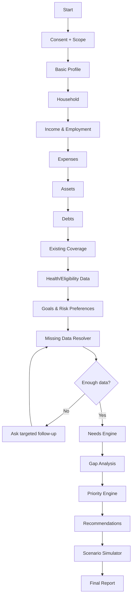
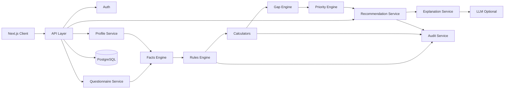

# Insurance Advisor Platform – Product Requirements Document (PRD/PDR)
## גרסה 1.0 – מערכת ליווי ואפיון צרכי ביטוח מונחית נתונים

> **מטרת המסמך:** מסמך Implementation-ready עבור Claude Code לבניית מערכת שממליצה על צרכי ביטוח, מבוססת תשובות של המשתמש, ללא פערי הבנה בין הדרישה העסקית להטמעה הטכנית: מודל נתונים מלא, מודל חוקים, סוגי חישוב, ממשק אדמין/ניקוד למשקל, סדר עדיפויות, ומסגרת בדיקות.
>
> **עקרון ארכיטקטוני:** אין שלב שנקרא "המלצה" סופית ומוחלטת. המלצת המערכת מבוססת על מנוע חוקים דטרמיניסטי, versioned וניתן לבקרה. LLM יכול לשמש להסבר, הבנת טקסט חופשי, ניסוח בהיר, לא לייצור מסקנות שאינן נשלטות בקוד.
>
> **שוק היעד בתחילה:** ישראל.
>
> **סטטוס רגולטורי:** מסמך מוצר/תכן הנדסי, לא חוות דעת משפטית. לפני הפעלה מסחרית בפועל בישראל צריכה להתבצע review משפטי/רגולטורי ייעודי מול הרשות לניירות ערך/שוק ההון, וכן review מול רישוי סוכן ביטוח, אם התהליך כולל ייעוץ אישי לפי נתוני המשתמש.

---

# 1. Executive Summary

מערכת בשם Insurance Needs Analysis Platform מתפעלת שיחה מונחית נתונים.

במקום שאלון סטטי גנרי, המערכת:

1. אוספת נתוני פרופיל.
2. בונה מודל Household פיננסי/משפחתי/תעסוקתי.
3. מזהה חשיפת סיכון.
4. שואלת רק שאלות רלוונטיות אמיתיות.
5. מחשבת פערי כיסוי קיימים.
6. מתעדפת צרכים לפי חומרה.
7. מפיקה המלצות לפי עוצפות.
8. לכל המלצה מציגה:
   - סוג הביטוח.
   - סכום נדרש / מומלץ / מקסימלי / או ריבוד.
   - סכום קיים.
   - סכום קצוב.
   - פער.
   - משך זמן מומלץ מוצע.
   - trigger לבדיקה/עדכון/ביטול.
   - rationale.
   - assumptions.
   - confidence/data-quality.
9. מאפשרת סימולציות של תרחישים.
10. שומרת Audit Trail מלא.

---

# 2. Product Vision

## 2.1 החזון

המטרה "מנוע ליווי אישי" להחליף שאלון תשואת ביטוח בפורמט:

- עקרי.
- ברור.
- מוסבר.
- נתון לשחזור.
- נתון למבוקרות.
- מתאים לצרכים.
- מונע ביטוחים כפולים.
- מונע חוסר תפקוד.
- אינו מפריז ואינו ממציא.

## 2.2 חוויית המוצר

המערכת אינה נועדת רק:

> "תגיד לי כמה ביטוח צריך."

היא נועדת לומר:

> "לפי מה שתיארת, נוצר מצב חשיפה מסוים במשפחה במקרה פטירה של X. קיים כרגע Y כיסוי קצבה/ביטוח של נתון קצוב במשפחה. הפער הוא Z. מומלץ טווח כיסוי A-B, עם שיקול להעריך מחדש בכל קבע אם עם שינוי בהכנסה משמעותי תחת ספ."

---

# 3. Product Scope

## 3.1 MVP

ה-MVP מתמקד:

- פרופיל בסיסי.
- בן/בת זוג.
- ילדים ותלויים.
- מקצוע.
- העסקה.
- נכסים פיננסיים.
- התחייבויות.
- משכנתה.
- מצב תעסוקתי.
- כיסויים קיימים.
- אימות נתונים ידני.
- זיהוי פערים בסיסיים.
- המלצות מבוססות עבור:
  - ביטוח חיים.
  - ביטוח אבדן כושר עבודה / הכנסה חודשית.
  - מחלות קשות.
  - הרחבות פרטיות.
  - סיעודי.
  - תאונות אישיות – רק אם engine קובע רלוונטי.
  - חפיפה וכפילות – מתבסס בין קיים ומתוכנן חדש.
- תעדוף המלצות.
- דוח סופי.
- Audit Trail.

## 3.2 Phase 2

- קליטת מסמכים/PDF.
- OCR/document parsing.
- אינטגרציה עם נתונים – מ"הר הביטוח" באתר להשוואת פרטי ביטוח.
- אינטגרציה עם מסלקה פנסיונית באתר הרשות לניירות ערך/שוק ההון.
- Partner/Agent Portal.
- Pricing engine.
- Product matching מבוסס ספציפיות.
- Underwriting pre-check.
- השוואת פרמיות.
- תמיכה בבני/בנות זוג מעם ראשוני.
- e-sign.
- CRM.

## 3.3 Out of Scope ב-MVP

- רישום פוליסות של ביטוח.
- אוטומציה מלאה.
- אוטומציה מקבלת מסחר.
- אבחון רפואיות.
- פרשנות משפטית סופית של תנאי פוליסה.
- "נעילה" המלצות קצובות.
- Recommendation מבוססת עמלה.

---

# 4. Regulatory / Compliance Guardrails

## 4.1 עקרון אמת

יש להפריד בין שלבי:

1. **Needs Analysis**
2. **Recommendation**
3. **Product Matching**
4. **Sales / Marketing**
5. **Execution**

לכל stage יהיה feature flag עצמי.

```ts
type RegulatoryFeatureFlags = {
  needsAnalysis: boolean;
  personalizedRecommendation: boolean;
  productComparison: boolean;
  insurerSpecificRecommendation: boolean;
  quoteGeneration: boolean;
  purchaseFlow: boolean;
};
```

## 4.2 מודל ביקורת

כל Recommendation תרשום:

```ts
type RecommendationAudit = {
  recommendationId: string;
  userId: string;
  questionnaireVersion: string;
  ruleEngineVersion: string;
  policyCatalogVersion?: string;
  createdAt: string;

  inputSnapshotHash: string;
  factsUsed: FactReference[];
  assumptions: Assumption[];
  formulas: CalculationTrace[];
  rulesTriggered: RuleTrace[];
  exclusionsTriggered: RuleTrace[];

  output: Recommendation;
};
```

## 4.3 Disclaimer Modes

### MVP / Educational
"זה ניתוח מדיד מסייע לצרכים המפורטים ואינה מהווה תחליף/שיווק עם בעל רישיון מתאים שיאשר לך המלצה סופית."

### Licensed Flow
אם המערכת מופעלת תחת בעל רישיון:

- licenseeName
- licenseNumber
- licenseType
- disclosure
- relationshipToInsurers
- compensationDisclosure, אם ישנם
- timestamp

יש לבצע ייעוץ נוסף המשפטי לפני Production.

---

# 5. User Personas

## Persona A – שכיר עם משפחה

- גיל 30-55.
- נשוי.
- ילדים.
- פנסיה.
- התחייבויות קבועות או פרטיות.
- רוצה בסיס לתמונת ביטוח צורך.

## Persona B – עצמאי

- הכנסה משתנה.
- אין תעסוקתית מטעם מעסיק.
- תפיסת סיכון תלויה עצמו.
- צריך להתייחשל cashflow.

## Persona C – רווק ללא תלויים

- ערך צריך לביטוח מוגבל.
- צריך למנוע ביטוח מיותר/כפילות.
- יש אינטרס למניעת פתח שוק ריסק מיותר.

## Persona D – מפני פרישה

- צריך לתכנן עושר לתקופה.
- צריך להתייחס/סעיף עושר מעטה.
- יש מיקוד יכולת מימוש עצמי.

---

# 6. Core User Journey



---

# 7. Conversation Engine

## 7.1 עקרונות

אין מטרה 70 שאלות אחת אחרי השנייה.

כל שאלה מתוארת כאובייקט מקונפג:

```ts
type Question = {
  id: string;
  version: number;
  category: QuestionCategory;
  text: string;
  helpText?: string;

  answerType:
    | "text"
    | "number"
    | "money"
    | "date"
    | "boolean"
    | "single_select"
    | "multi_select";

  required: boolean;

  showWhen?: Expression;
  requiredWhen?: Expression;

  validation?: ValidationRule[];
  normalizer?: string;

  factsProduced: string[];
  followUpQuestionIds?: string[];
};
```

## 7.2 Question Selection

מנגנון קצה:

```ts
getNextQuestion(profile, answers, recommendationState)
```

מתואר את המשקל על:

```text
questionScore =
    decisionImpact
  × uncertainty
  × relevance
  × answerability
  - userBurdenPenalty
```

## 7.3 שאלות לפי קטגוריות

### פרטים דמוגרפיים
- גיל / תאריך לידה.
- מצב משפחתי.
- בן/בת זוג.
- גיל בן/בת זוג.
- מספר ילדים.
- גיל כל ילד.
- תושבות נוספת.

### תעסוקה
- ענף עיסוקי.
- מקצוע עיסוקי.
- תעסוקה נוספת.
- כיסוית פנסוה.
- עצמאי / שכיר / בעל שליטה.

### הוצאות
- הוצאות משק בית.
- הוצאה על חינוך.
- תשלומי משכנתה.
- childcare.
- חובות נוספים.
- תמיכה במשפחה מורחבת.
- הוצאות בלתי קבועות.

### נכסים
- מזומן.
- פיקדונות.
- תיק השקעות.
- קרן השתלמות/פנסיה.
- נכסים מהוונים של עצמו/או ניתן מהוונים למשפחה.
- נכס נדל"ן.
- שווי מוחזק בעלות עסק.

### התחייבויות
- משכנתה.
- הלוואות.
- ערבויות.
- כרטיסי אשראי.

### תעסוקה
- מקצוע.
- האם עיסוק תואם עיסוק פנוי?
- מעסיק.
- ותק.
- תעודות סמכותיות.
- מצב עסקי.
- מסמך ח"פ קיים.
- האם עיסוק של אחד מבני הזוג נחשב עיסוק מוגבר סיכון?

### ביטוחים
כל פוליסה כוללת:
- provider.
- policy type.
- insured person.
- coverage amount.
- monthly premium.
- expiration date.
- waiting period.
- exclusions if known.
- indexation.
- beneficiary.
- source.
- verified/unverified.

### רפואי
ב-MVP נאסף רק המידע שנדרש ל-recommendation/eligibility ברור ורלוונטי.

המערכת אינה מבצע Diagnosis.

לדוגמה:
- עישון.
- מצב רפואי משמעותי קיים.
- תרופות קבועות.
- אירוע רפואי משמעותי עתידי.
- עיסוק מסוכן.
- תחביב מסוכן.

מידע רפואי מסומן `sensitive=true`.

---

# 8. Facts Layer

מסבר ידע מגורם מקרוב מכל השאלות Answers.

יש שכבת Facts מנורמלת:

```ts
type Fact<T = unknown> = {
  key: string;
  value: T;
  source: "user" | "document" | "integration" | "derived";
  confidence: number;
  verified: boolean;
  effectiveDate?: string;
};
```

דוגמאות:

```text
person.age = 47
household.children.count = 2
household.youngestChildAge = 16
income.user.netMonthly = 26000
income.household.netMonthly = 34000
expenses.household.monthly = 23000
debt.mortgage.balance = 650000
coverage.life.total = 1500000
```

---

# 9. Data Quality

לפני recommendation:

```text
dataCompleteness = requiredFactsPresent / requiredFacts
```

## thresholds

- 0.90–1.00 – HIGH
- 0.75–0.89 – MEDIUM
- <0.75 – LOW

מסבר יוצג Recommendation מסומן כלא definitive כאשר confidence LOW.

במקום:

> 1,200,000 ₪

יוצג:

> טווח משוער 900,000–1,400,000 ₪. מסרנו נתון X/Y.

---

# 10. Needs Engine Architecture

```text
Questionnaire
     ↓
Normalized Facts
     ↓
Eligibility Rules
     ↓
Need Calculators
     ↓
Existing Coverage Offset
     ↓
Gap Calculator
     ↓
Priority Scoring
     ↓
Affordability Layer
     ↓
Recommendation Presenter
```

---

# 11. Rule Engine

## 11.1 Rules as Data

אין hard-code את המשקולות בתוך controllers.

```json
{
  "id": "LIFE_DEPENDENTS_001",
  "version": 1,
  "category": "life",
  "when": {
    "all": [
      {"fact": "household.dependents.count", "operator": ">", "value": 0}
    ]
  },
  "effect": {
    "needStatus": "evaluate"
  },
  "reason": "קיימים עם תלויים כלכליים נדרש הערכת צורך ביטוח חיים."
}
```

## 11.2 Rule States

```ts
type NeedStatus =
  | "required_to_evaluate"
  | "recommended"
  | "optional"
  | "not_needed"
  | "insufficient_data"
  | "manual_review";
```

---

# 12. Life Insurance Calculator

## 12.1 מטרה

לחשב את הצורך המהותי במשק הבית במקרה פטירה.

## 12.2 Core Model

```text
GrossLifeNeed =
    ImmediateExpenses
  + DebtPayoffNeed
  + IncomeReplacementNeed
  + ChildSupportNeed
  + EducationNeed
  + SpecialDependentNeed
  + OtherGoals

AvailableResources =
    ExistingLifeInsurance
  + SurvivorBenefitsPresentValue
  + EarmarkedLiquidAssets
  + EarmarkedOtherAssets

LifeGap =
    max(0, GrossLifeNeed - AvailableResources)
```

## 12.3 Income Replacement

Preferred model:

```text
AnnualIncomeDependency =
    max(0,
        householdRequiredAnnualSpend
        - survivorReliableAnnualIncome
        - reliableOtherAnnualIncome
    )
```

For each year `t`:

```text
PV(t) =
 AnnualIncomeDependency(t)
 / (1 + realDiscountRate)^t
```

```text
IncomeReplacementNeed = Σ PV(t)
```

**חשוב:** `realDiscountRate` הוא config לא קבוע בקוד.

```ts
financialAssumptions.realDiscountRate
financialAssumptions.inflationRate
financialAssumptions.salaryGrowthRate
```

## 12.4 Coverage Horizon

הגדרת ברירת מחדל engine:

```text
horizon = max(
    yearsUntilYoungestDependentTargetAge,
    yearsUntilMajorDebtTargetDate,
    userSelectedProtectionHorizon
)
```

לא מומלץ ברירת מחדל קבועה שה"גיל = 21".

Config:

```json
{
  "dependentTargetAge": 21,
  "allowUserOverride": true
}
```

המערכת מציגה למשתמש שזהו assumption של ניתן לשנות.

## 12.5 Mortgage

אם קיימת התחייבותית את המשכנתה עם משכנתה כמובן כיסוי נוסף למשפחה.

יש להבחין:

```text
mortgageInsuranceBeneficiary = lender
```

אין לפרשן ולחשוב את יתרת המשכנתה:
- נתון מהפרשן את DebtPayoffNeed.
- אסור להוסיף את הסכום כ-cash resource של המשפחה.

## 12.6 Output

```ts
type LifeRecommendation = {
  grossNeed: Money;
  existingEffectiveCoverage: Money;
  resourceOffsets: Money;
  recommendedGap: Money;

  recommendedRange: {
    min: Money;
    target: Money;
    max: Money;
  };

  horizonYears: number;
  reviewTriggers: string[];

  calculationTrace: CalculationTrace[];
};
```

---

# 13. Income Protection / Disability

## 13.1 Need

```text
RequiredMonthlyIncome =
    EssentialMonthlyExpenses
  + DebtMonthlyPayments
  + DependentsMonthlyNeeds
  - ReliableIncomeDuringDisability
```

## 13.2 Existing Coverage

יש להוסיף:

- pension disability coverage.
- private income protection.
- employer coverage.
- waiting period.
- max monthly benefit.
- definition of occupation.
- offsets.
- benefit duration.

## 13.3 Gap

```text
MonthlyDisabilityGap =
    max(
       0,
       RequiredMonthlyIncome
       - ExistingNetExpectedDisabilityIncome
    )
```

יש להמליץ עם סכום שאינו עולה ממקסום/אפשרי אפשרי לפי נתוני מוצרים. Product-specific cap ממוקם בשלב Product Matching.

## 13.4 Duration

```text
recommendedDuration =
    min(
      retirementAge - currentAge,
      productMaximumDuration
    )
```

יש לאפשר `retirementAge` configurable לפי מדיניות/מוצר.

---

# 14. Critical Illness

מרבית מוצר – "אבחון מחלה קשה מוגדרת" מיועד לתת lump-sum buffer.

## Proposed Needs Model

```text
CriticalIllnessNeed =
    RecoveryExpenseBuffer
  + IncomeGapDuringRecovery
  + Deductible/NonCoveredMedicalBuffer
  + DebtServiceBuffer
  + HouseholdSupportBuffer
```

Recovery duration assumption configurable:

```text
3 / 6 / 12 / 18 / 24 months
```

Recommended amount:

```text
CriticalIllnessGap =
 max(0, CriticalIllnessNeed - ExistingCriticalIllnessCoverage)
```

המערכת תציג Scenario של מספר משך התאוששות.

---

# 15. Private Health Insurance

יש להימנע מ"סכום אחד" ויותר יש להציג מוצר service/expense based.

Engine ממפה modules:

```ts
type HealthCoverageModule =
  | "surgeries_israel"
  | "surgeries_abroad"
  | "transplants"
  | "special_treatments_abroad"
  | "medications_outside_basket"
  | "ambulatory"
  | "personalized_medicine";
```

לכל module:

```ts
type ModuleAssessment = {
  module: HealthCoverageModule;
  existing: boolean | "unknown";
  need: "high" | "medium" | "low" | "not_applicable";
  duplicateRisk: boolean;
  reasonCodes: string[];
};
```

לא מומלץ "צריך 1,000,000 ₪ בריאות" אלא הצגה משמעותית מוצרית של המודול.

---

# 16. Long-Term Care

המערכת צריכה לאפיין את:

- expected monthly care cost assumption.
- public/health-fund benefit assumptions.
- private LTC coverage.
- assets available for self-funding.

```text
MonthlyLTCGap =
    ExpectedMonthlyCareCost
  - ReliableMonthlyLTCBenefits
  - MonthlySelfFundingCapacity
```

```text
CapitalLTCNeed =
    PV(MonthlyLTCGap × expectedDuration)
```

Expected duration יכול להיות scenario parameter עם "תוחלת רפואית" עם טווח.

---

# 17. Personal Accident Insurance

המערכת לא תמליץ אוטומטית.

Trigger אפשריים:

- occupation risk.
- hobby risk.
- temporary cashflow need.
- no overlapping benefit.
- affordability.

אם קיימת חפיפה משמעותית עם protections אחרים:

```text
priorityPenalty += overlapPenalty
```

---

# 18. Existing Insurance Deduplication

לכל coverage:

```ts
type Coverage = {
  id: string;
  category: string;
  subtype: string;

  insuredPersonId: string;
  beneficiaryType?: "person" | "lender" | "estate" | "other";

  amount?: number;
  monthlyBenefit?: number;

  startDate?: string;
  endDate?: string;
  waitingPeriodDays?: number;

  verified: boolean;
  source: string;

  exclusionsKnown: boolean;
  notes?: string;
};
```

## Duplicate Detection

```text
duplicateScore =
    sameInsuredWeight
  + sameRiskWeight
  + overlappingBenefitWeight
  + overlappingTermWeight
```

המערכת מעדכן את התראת "כפילות פוטנציאלית" רק אם duplicateScore גבוה.

Output:

> "התגלתה חפיפה אפשרית. נדרשת בדיקת תנאי הפוליסאות לפני שינוי."

---

# 19. Recommendation Priority Engine

## 19.1 Scoring

כל recommendation מקבלת 0–100.

```text
PriorityScore =
    SeverityWeight       * severity
  + ProbabilityWeight    * exposure
  + DependencyWeight     * dependentImpact
  + GapWeight            * gapRatio
  + IrreplaceabilityWeight * irrecoverability
  + UrgencyWeight        * urgency
  - ExistingCoverageWeight * coverageAdequacy
  - AffordabilityPenalty
  - DuplicatePenalty
```

Default weights נשמרים ב-DB/config.

אין weights "קסומות" קבועות.

## 19.2 Priority Bands

- 80–100 CRITICAL
- 60–79 HIGH
- 40–59 MEDIUM
- 20–39 LOW
- 0–19 INFORMATIONAL

Names configurable.

---

# 20. Budget / Affordability Engine

המערכת תשאל:

```text
What monthly amount are you comfortable allocating to protection?
```

יש תאפשר:

- כמה מוכנים להוציא.
- רוצה כמה כמה מוכר.
- Budget X ₪.

## Rule

אסור המערכת affordability משנה את הNeed.

לדוגמה:

```text
Need = 2,000,000
BudgetSupportedCoverage = 1,200,000
```

Output:

```text
Calculated Need: 2,000,000
Budget-Constrained Option: 1,200,000
Remaining Uninsured Gap: 800,000
```

אין "מעלים" gap.

---

# 21. Recommendation Object

```ts
type Recommendation = {
  id: string;
  category: InsuranceCategory;
  title: string;

  status:
    | "recommended"
    | "consider"
    | "not_needed"
    | "review_existing"
    | "manual_review";

  priorityScore: number;
  priorityBand: string;

  needAmount?: number;
  existingAmount?: number;
  gapAmount?: number;

  recommendedMin?: number;
  recommendedTarget?: number;
  recommendedMax?: number;

  monthlyBenefitTarget?: number;

  horizon?: {
    type: "age" | "date" | "years" | "event";
    value: string | number;
  };

  reviewTriggers: ReviewTrigger[];

  rationale: string[];
  reasonCodes: string[];

  missingFacts: string[];
  assumptions: Assumption[];
  warnings: string[];

  confidence: "high" | "medium" | "low";

  calculationTraceId: string;
};
```

---

# 22. Review / Holding Period Engine

המערכת אינה רק מוציאה "פעם אחד".

כל recommendation מקבל lifecycle.

## Review Triggers

```ts
type ReviewTrigger =
  | "marriage"
  | "divorce"
  | "birth"
  | "child_independent"
  | "income_change_20pct"
  | "new_mortgage"
  | "mortgage_repaid"
  | "job_change"
  | "self_employment"
  | "retirement"
  | "major_asset_change"
  | "major_health_change"
  | "policy_expiry"
  | "annual_review";
```

## Example

Life insurance:

```text
Hold until:
- youngest dependent reaches configured independence age
OR
- need falls below minimum materiality threshold

Review:
- annually
- after mortgage repayment
- ±20% household income
- family status change
```

---

# 23. Scenario Simulator

User can alter:

- survivor income.
- desired lifestyle percentage.
- dependent target age.
- mortgage payoff.
- education reserve.
- emergency reserve.
- discount rate.
- self-funding assets.
- budget.

UI shows instantly:

```text
Current scenario
Conservative scenario
Balanced scenario
Lean scenario
```

אין מציגה scenario "נעולה".

---

# 24. Explainability

כל מספר clickable.

Example:

```text
Recommended Life Cover: 1,850,000 ₪
```

Expand:

```text
+ 1,420,000  Income replacement
+   650,000  Mortgage
+   180,000  Education reserve
+    70,000  Immediate expenses
------------
 2,320,000  Gross need

-   300,000  Existing effective cover
-   170,000  Earmarked liquid assets
------------
 1,850,000  Calculated gap
```

המערכת חייבת להציג:
- מקור כל fact.
- assumption.
- formula.
- rounding.

---

# 25. Money / Rounding

אין calculations ב-integer agorot או decimal library.

אסור JS floating point כמעט.

```ts
Money = Decimal
```

Presentation rounding configurable:

```text
nearest 1,000
nearest 10,000
exact
```

Audit שומר exact + displayed.

---

# 26. Data Model

## 26.1 Core Entities

```text
User
ClientProfile
Person
Household
Dependent
Employment
IncomeSource
Expense
Asset
Liability
Mortgage
ExistingPolicy
Coverage
HealthDisclosure
Goal
Answer
Fact
Recommendation
CalculationTrace
RuleExecution
Scenario
Report
Consent
AuditEvent
```

## 26.2 Suggested PostgreSQL Schema

```sql
users
client_profiles
persons
dependents
income_sources
expenses
assets
liabilities
policies
coverages
questionnaire_sessions
answers
facts
recommendations
calculation_traces
rule_executions
scenarios
reports
consents
audit_events
config_versions
```

לכל table יש:

```sql
id uuid primary key
created_at timestamptz
updated_at timestamptz
```

Sensitive tables:

```sql
health_disclosures
identifiers
documents
```

מוצפנות/ממוסך נדרשת.

---

# 27. Suggested Technical Stack

## Monorepo

```text
/apps/web
/apps/api
/packages/domain
/packages/rules
/packages/calculators
/packages/questionnaire
/packages/ui
/packages/shared
/packages/config
/packages/test-fixtures
```

## Recommended

Frontend:
- Next.js
- TypeScript
- React
- Tailwind
- React Hook Form
- Zod

Backend:
- Node.js + TypeScript
- NestJS or Fastify
- PostgreSQL
- Prisma

Queue:
- BullMQ / Redis only when async jobs are introduced.

Testing:
- Vitest
- Playwright
- property-based testing for calculators where useful.

Observability:
- structured logs
- OpenTelemetry
- Sentry compatible error tracking

Authentication:
- OAuth/OIDC compatible provider.

---

# 28. Architecture



---

# 29. LLM Boundary

## Allowed

LLM may:

- paraphrase a question.
- understand free text.
- classify user intent.
- extract candidate facts.
- ask clarification.
- explain deterministic result.
- summarize report.

## Forbidden

LLM must not independently:

- invent coverage amount.
- choose insurer.
- invent policy terms.
- infer medical facts.
- override eligibility rules.
- silently alter numeric calculation.
- mark data verified.
- cancel existing insurance.
- produce recommendation without engine result.

## Tool Contract

LLM receives:

```json
{
  "recommendation": {},
  "calculationTrace": [],
  "allowedFacts": [],
  "requiredDisclosures": []
}
```

System Prompt:

```text
You are an explanation layer.
Never alter numeric values.
Never introduce a new recommendation.
Never claim a policy contains coverage unless present in supplied data.
When data is unknown, explicitly state that it is unknown.
```

---

# 30. AI Fact Extraction

Free text example:

> "יש לי ביטוח חיים אצל כלל, וגם ביטוח חיים למשכנתה בסך 400 אלף במשכנתה."

LLM extractor returns candidate facts:

```json
[
  {
    "key": "coverage.life.candidate",
    "value": 1500000,
    "provider": "Clal",
    "confidence": 0.91,
    "verified": false
  },
  {
    "key": "coverage.mortgageLife.candidate",
    "value": 400000,
    "confidence": 0.82,
    "verified": false
  }
]
```

UI asks confirmation before promoted to trusted Fact.

---

# 31. API Contract

## Questionnaire

```http
POST /api/v1/sessions
GET  /api/v1/sessions/:id/next-question
POST /api/v1/sessions/:id/answers
GET  /api/v1/sessions/:id/progress
```

## Profile

```http
GET /api/v1/profile
PUT /api/v1/profile
```

## Analysis

```http
POST /api/v1/analysis/run
GET  /api/v1/analysis/:id
GET  /api/v1/analysis/:id/trace
```

## Scenario

```http
POST /api/v1/analysis/:id/scenarios
PUT  /api/v1/scenarios/:id
POST /api/v1/scenarios/:id/recalculate
```

## Report

```http
POST /api/v1/analysis/:id/report
GET  /api/v1/reports/:id
```

---

# 32. POST /analysis/run

Request:

```json
{
  "profileId": "uuid",
  "scenarioId": null,
  "engineVersion": "latest"
}
```

Response:

```json
{
  "analysisId": "uuid",
  "status": "complete",
  "dataQuality": {
    "score": 0.94,
    "level": "high"
  },
  "recommendations": [],
  "unresolvedQuestions": [],
  "warnings": []
}
```

---

# 33. Validation

Examples:

```text
age: 0..120
money: >= 0
monthly income: sanity limit + warning, not silent rejection
child DOB <= today
policy end date >= start date
mortgage balance <= configurable max
```

כאשר ערך חריג:

> "הזנת הכנסה חודשית של 2,600,000 ₪. האם זה נכון?"

אין נתקן אוטו.

---

# 34. Security

מדובר על נתונים פיננסים ורפואיים רגישים.

Minimum requirements:

- TLS.
- encryption at rest.
- secrets manager.
- RBAC.
- least privilege.
- audit logs.
- immutable recommendation audit.
- session timeout.
- rate limiting.
- CSRF protection.
- secure cookies.
- MFA option.
- deletion/retention policy.
- consent records.
- no sensitive data in application logs.
- redact LLM payloads.
- provider with acceptable data-processing terms.
- configurable "LLM disabled" mode.

---

# 35. Consent Model

```ts
type Consent = {
  id: string;
  type:
    | "terms"
    | "privacy"
    | "sensitive_data"
    | "document_processing"
    | "ai_processing"
    | "marketing";
  version: string;
  accepted: boolean;
  acceptedAt: string;
  ipHash?: string;
};
```

Marketing consent separate from service consent.

---

# 36. Audit Log

```ts
type AuditEvent = {
  id: string;
  actorType: "user" | "agent" | "system" | "admin";
  actorId?: string;

  action: string;
  entityType: string;
  entityId: string;

  beforeHash?: string;
  afterHash?: string;

  ruleEngineVersion?: string;
  createdAt: string;
};
```

אסור למחוק audit events מדרך normal application endpoints.

---

# 37. UI Requirements

## Main Screen

Progress:

```text
משפחה     ✓
ביטוח     ✓
הוצאות    ✓
נכסים     80%
התחייבות     ✓
תעסוקתי   60%
----------
השלמת נתונים: 88%
```

## Recommendation Card

```text
ביטוח חיים
Priority: HIGH

צורך חישובי:       1,850,000 ₪
כיסוי קיים:         900,000 ₪
פער:                950,000 ₪

טווח מוצע:
900,000–1,050,000 ₪

למה:
ב-6 שנים הקרובות, החזר משכנתה עם השלמת ההכנסה המשפחתית

איך?
[Expand]

מה קרה מחושב?
[Expand]

מה נשען את הכיסוי?
[Expand]
```

---

# 38. Dashboard

Sections:

1. Protection Score.
2. Missing critical data.
3. Current coverage.
4. Gaps.
5. Potential overlaps.
6. Recommendations by priority.
7. Monthly budget.
8. Scenario comparison.
9. Next review date.

אין מציגה score ללא פירוט.

---

# 39. Report Structure

```text
1. Executive summary
2. Data supplied
3. Assumptions
4. Household risk map
5. Existing coverage
6. Calculated needs
7. Gaps
8. Recommendations
9. Priority order
10. Budget constrained alternative
11. Possible overlaps
12. Holding/review horizon
13. Unknown data
14. Calculation methodology
15. Disclosures
16. Engine version + report timestamp
```

---

# 40. Recommendation Reason Codes

Examples:

```text
LIFE_DEPENDENTS_PRESENT
LIFE_INCOME_DEPENDENCY
LIFE_MORTGAGE_GAP
LIFE_EXISTING_COVERAGE_SUFFICIENT

DI_INCOME_DEPENDENCY
DI_EXISTING_MONTHLY_GAP

CI_LOW_LIQUID_BUFFER
CI_EXISTING_COVERAGE_PRESENT

HEALTH_MODULE_UNKNOWN
HEALTH_DUPLICATE_POSSIBLE

LTC_SELF_FUNDING_CAPACITY_HIGH
LTC_MONTHLY_GAP
```

Frontend translates reason code.

---

# 41. Config Versioning

```ts
type EngineConfig = {
  version: string;
  effectiveFrom: string;

  financialAssumptions: {
    realDiscountRate: number;
    inflationRate: number;
  };

  dependentAssumptions: {
    targetAge: number;
  };

  thresholds: {
    materialGap: number;
    incomeChangeReviewPct: number;
  };

  priorityWeights: Record<string, number>;
};
```

כל Analysis snapshot שומר config version.

אסור לא לשנות report מסוכמת עם קונפיגורציה עם קונפיג שונה.

---

# 42. Test Strategy

## Unit Tests

לכל calculator.

Example:

```text
Given:
income need = 10,000/month
duration = 10 years
real discount = 0
existing resources = 200,000

Expected:
gross = 1,200,000
gap = 1,000,000
```

## Boundary Tests

- no dependents.
- negative values rejected.
- age 0.
- age 120.
- mortgage > assets.
- no income.
- two incomes.
- existing coverage > calculated need.
- unknown policies.
- duplicate policies.
- retired user.
- disabled/non-working user.
- self-employed.
- single parent.

## Golden Cases

Create `/packages/test-fixtures/golden-cases`.

At least 30 household profiles.

Each includes expected:
- need status.
- numeric range.
- triggered rules.
- missing facts.

---

# 43. Safety Tests

Must fail build if system:

- recommends life cover to user with no dependency reason and no explicit estate/debt need.
- outputs negative gap.
- invents existing policy.
- treats mortgage lender benefit as family cash.
- changes numeric values in LLM explanation.
- labels unverified fact as verified.
- calculates recommendation from stale profile without warning.
- suppresses uninsured gap because budget is too low.

---

# 44. Acceptance Criteria – MVP

MVP complete only when:

- [ ] user can finish adaptive questionnaire.
- [ ] progress and missing data shown.
- [ ] profile stored.
- [ ] existing coverages stored.
- [ ] life calculator implemented.
- [ ] income protection calculator implemented.
- [ ] critical illness model implemented.
- [ ] health module gap analysis implemented.
- [ ] LTC scenario model implemented.
- [ ] deduplication implemented.
- [ ] priority engine implemented.
- [ ] scenario simulator implemented.
- [ ] every numeric output has trace.
- [ ] rule/config versions stored.
- [ ] report generated.
- [ ] audit log available.
- [ ] no LLM required to calculate recommendations.
- [ ] tests cover golden cases.
- [ ] sensitive data not logged.
- [ ] disclaimer/consent flow implemented.

---

# 45. Suggested Development Milestones

## Milestone 1 – Domain
- monorepo
- DB
- domain models
- money handling
- facts layer

## Milestone 2 – Questionnaire
- question schema
- conditional questions
- answer validation
- profile creation
- progress

## Milestone 3 – Engine
- rule engine
- life calculator
- disability calculator
- trace framework

## Milestone 4 – Remaining Needs
- CI
- health
- LTC
- overlap

## Milestone 5 – Recommendation
- gap engine
- priority
- budget
- lifecycle

## Milestone 6 – UI
- dashboard
- explanation cards
- scenario simulator

## Milestone 7 – Report
- report renderer
- export
- audit

## Milestone 8 – LLM
- conversational UX
- candidate fact extraction
- explanation-only contract

## Milestone 9 – Hardening
- security
- tests
- monitoring
- compliance configuration

---

# 46. Claude Code Implementation Instructions

## Mandatory rules for Claude Code

1. Read this entire PRD before coding.
2. Do not implement the whole product in one file.
3. Build the domain and calculators before AI.
4. Use TypeScript strict mode.
5. Avoid `any`.
6. All money uses Decimal.
7. No numeric insurance recommendation may originate from an LLM.
8. Every calculator returns calculation trace.
9. Every recommendation identifies rule/config version.
10. Rules should be data/config driven.
11. Do not hard-code Israeli product limitations unless supplied in verified config.
12. Unknown values remain unknown.
13. Never convert unknown → false/0.
14. Add tests before moving to next calculator.
15. Run lint/typecheck/test after every milestone.
16. Do not silently change schema.
17. Use database migrations.
18. Maintain `/docs/DECISIONS.md`.
19. Maintain `/docs/ASSUMPTIONS.md`.
20. Maintain `/docs/REGULATORY-TODO.md`.

---

# 47. First Claude Code Prompt

Use the following as the first prompt after giving Claude Code this file:

```text
Read INSURANCE_ADVISOR_PRD.md completely.

Do not start building UI yet.

First:
1. Create an implementation plan mapped to the PRD sections.
2. Propose the monorepo folder structure.
3. Define the domain types.
4. Define the PostgreSQL/Prisma data model.
5. Define Money and CalculationTrace abstractions.
6. Define Facts and Answer models.
7. Define the rule-engine interface.
8. Define calculator interfaces.
9. Create test fixtures for 5 representative households.
10. List every assumption you had to make.

Constraints:
- TypeScript strict mode.
- PostgreSQL.
- Prisma.
- Decimal money arithmetic.
- No LLM-generated insurance amount.
- No insurer-specific logic yet.
- No production sales flow.
- Preserve complete explainability and auditability.

Before writing application features, show the proposed architecture and identify ambiguities or contradictions in the PRD.
Then implement Milestone 1 only.
Run typecheck, lint and tests and fix all failures.
```

---

# 48. Second Claude Code Prompt – Life Engine

```text
Implement the Life Insurance Needs Engine from the PRD.

Requirements:
- deterministic
- versioned config
- PV-based income replacement
- debt handling
- mortgage-beneficiary distinction
- earmarked asset offsets
- existing life cover
- min/target/max recommendation
- horizon calculation
- review triggers
- complete CalculationTrace
- reason codes
- missing-data handling
- high/medium/low confidence

Do not add product recommendations or insurer names.

Create at least 15 tests including:
- single with no dependents
- married no children
- married with children
- single parent
- mortgage
- mortgage insurance
- existing cover greater than need
- no liquid assets
- high liquid assets
- incomplete income
- incomplete expenses
- zero debt
- dependent with special need
- user override horizon
- rounding

Do not consider the task complete until all tests, lint and typecheck pass.
```

---

# 49. Third Claude Code Prompt – Adaptive Questionnaire

```text
Build the adaptive questionnaire engine.

The engine must choose questions based on:
- missing required facts
- recommendation impact
- relevance
- uncertainty
- user burden

Do not use an LLM for branching logic.

Implement:
- question schema
- showWhen
- requiredWhen
- validation
- normalizers
- fact production
- next-question selector
- completion score
- per-recommendation data completeness

Create a starter questionnaire sufficient for:
life, disability, critical illness, health and LTC assessment.

Add tests showing that irrelevant questions are skipped.
```

---

# 50. Future Product Matching Interface

Do not implement insurer selection in MVP.

Prepare interface:

```ts
interface ProductMatcher {
  match(
    recommendation: Recommendation,
    profile: ClientProfile
  ): Promise<ProductMatch[]>;
}
```

A ProductMatch must separate:

```text
NEED
from
PRODUCT
from
PRICE
from
ELIGIBILITY
```

Never let price alter historical calculated need.

---

# 51. Admin Console

Admins should be able to:

- view config versions.
- stage new config.
- compare old/new outputs against golden cases.
- approve/publish version.
- rollback.
- inspect recommendation trace.
- view rule executions.
- view failed analyses.

Publishing config requires explicit action.

---

# 52. Regression Simulator

Before publishing engine config:

Run every golden profile through:

```text
Old Engine
vs
New Engine
```

Show:

```text
Life target: 1.8M → 2.1M (+16.7%)
Priority: HIGH → CRITICAL
Reason change: ...
```

Admin must acknowledge material changes.

---

# 53. Explainability Standard

No recommendation can be returned unless:

```ts
recommendation.explainabilityComplete === true
```

Definition:

- all inputs referenced.
- all formulas stored.
- assumptions visible.
- exclusions visible.
- existing offsets visible.
- rule version visible.
- missing data visible.

---

# 54. Data Provenance

Every imported value stores provenance.

```ts
type DataProvenance = {
  sourceType:
    | "user"
    | "uploaded_policy"
    | "official_integration"
    | "agent"
    | "derived";

  sourceId?: string;
  extractedAt?: string;
  confirmedByUser?: boolean;
  verificationStatus:
    | "verified"
    | "user_confirmed"
    | "unverified";
};
```

---

# 55. Non-Functional Requirements

## Performance
- next question < 300ms backend target.
- deterministic analysis < 2s for normal profile.
- UI interactive without waiting for LLM.

## Reliability
- engine works if LLM provider unavailable.
- no recommendation loss on page refresh.
- idempotent analysis endpoint.

## Accessibility
- keyboard navigation.
- RTL Hebrew.
- semantic labels.
- WCAG-oriented contrast/layout.

## Localization
Start:
- `he-IL`
- currency ILS.

Architecture allows future locales.

---

# 56. Hebrew UX Rules

Use:

- "כיסוי קיים"
- "צורך חישובי"
- "פער"
- "טווח מומלץ"
- "מקור מסר"
- "מבוקר מוגדר"

Avoid:
- "אתה חייב להסתכן"
- "הכל"
- "האחריות היחידה שלך"
- "לא מבוסס"

אם הנתון אינו מספיק:

> "אין מספיק מידע כדי לחשב את זה במדויק."

---

# 57. Example End-to-End Case

## Input

```text
Age: 40
Spouse: 38
Children: 8, 5
Household spend: 22,000/month
Survivor reliable income: 12,000/month
Mortgage: 800,000
Mortgage cover: 800,000 lender-beneficiary
Existing personal life: 500,000
Earmarked assets: 200,000
Protection horizon: 16 years
```

## Simplified illustrative calculation

```text
Annual dependency:
(22,000 - 12,000) × 12
= 120,000

Assume for this test only:
real discount rate = 0

Income replacement:
120,000 × 16
= 1,920,000

Mortgage:
800,000 debt
- 800,000 valid mortgage life
= 0 remaining debt need

Other immediate/education needs:
configured example = 180,000

Gross family need:
1,920,000 + 180,000
= 2,100,000

Offsets:
500,000 personal life
+ 200,000 earmarked assets
= 700,000

Calculated gap:
2,100,000 - 700,000
= 1,400,000
```

Note:
Mortgage insurance was used to offset the mortgage debt,
not counted as 800,000 cash to the family.

---

# 58. Important Design Principle – Need vs Product

These must remain separate database concepts.

```text
InsuranceNeed
    ↓
Recommendation
    ↓
ProductRequirement
    ↓
CandidateProduct
    ↓
Quote
```

This prevents:

> "We have a 500k product, therefore the customer needs 500k."

Correct direction:

> "Customer need is 470k; then find the closest appropriate product structure."

---

# 59. Manual Review Triggers

Force manual review when:

- disputed facts.
- complex trust/estate need.
- business ownership dependency.
- key-person insurance.
- very high sums above configured threshold.
- unusual foreign residency.
- complex tax issue.
- existing coverage terms unknown but material.
- potentially conflicting recommendations.
- medical eligibility dominates feasibility.
- user asks for insurer-specific recommendation while feature not enabled.

---

# 60. Definition of Done

Product is not "done" because chat works.

It is done when:

1. identical facts + same config produce identical numeric output.
2. every recommendation can be reconstructed.
3. every number has trace.
4. unknowns remain explicit.
5. LLM outage does not break calculations.
6. golden cases pass.
7. config changes are versioned.
8. old reports remain reproducible.
9. sensitive information is protected.
10. compliance mode can disable regulated features independently.

---

# 61. Regulatory Sources / Verification Notes

This PRD deliberately does not encode detailed legal conclusions into the recommendation engine.

Current official references that should be reviewed before production in Israel:

1. **Knesset – Financial Services Supervision (Pension Counseling, Marketing and Clearing System) Law, 2005.**
   The national legislation database lists the law as in force and shows amendments through July 22, 2026.
   https://main.knesset.gov.il/apps/legislation/main/laws/2000504

2. **Capital Market, Insurance and Savings Authority – Licensing agents and advisers.**
   The Authority operates a licensing framework for insurance agents, pension marketing agents and pension advisers.
   https://www.gov.il/he/service/agents_licensing

3. **Capital Market, Insurance and Savings Authority – Search for licensed agents/advisers.**
   Official register/search service for licensed professionals.
   https://www.gov.il/he/service/agents_and_consultants_search

Before launch, legal counsel should verify:
- whether the exact flow constitutes regulated advice/marketing;
- required license ownership/identity;
- disclosure language;
- record retention;
- privacy and sensitive-data obligations;
- rules for insurer/product comparison;
- commission/conflict disclosures;
- permissible integrations and customer authorizations.

Do not let Claude Code convert this section into hard-coded legal rules without a separately approved regulatory specification.
